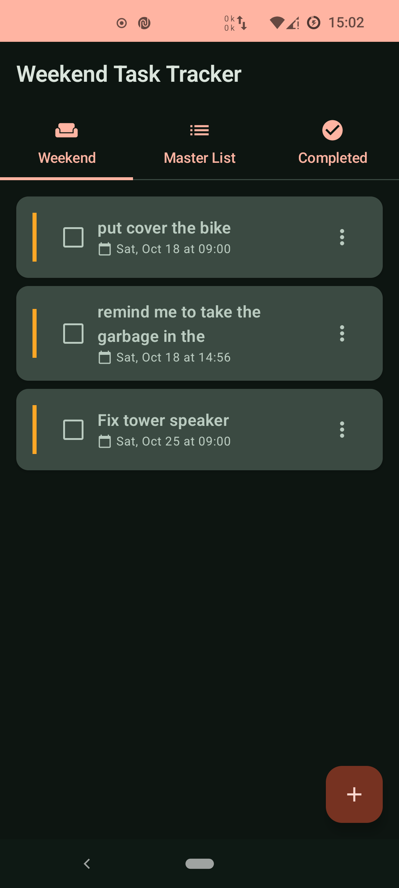
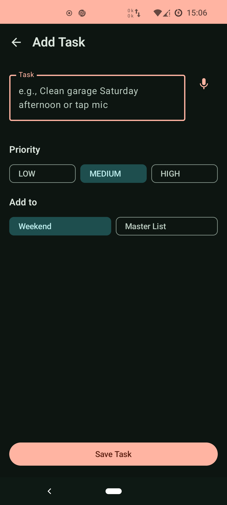
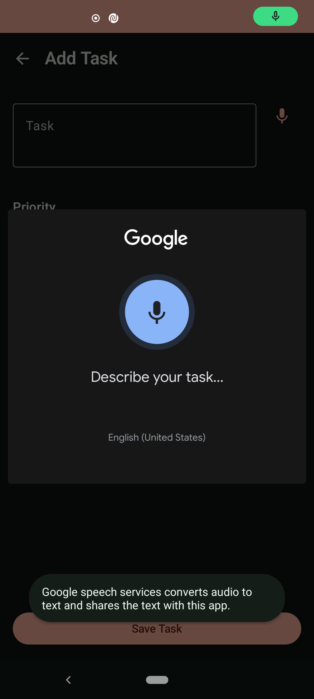
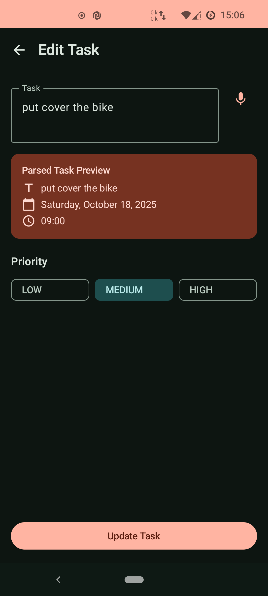
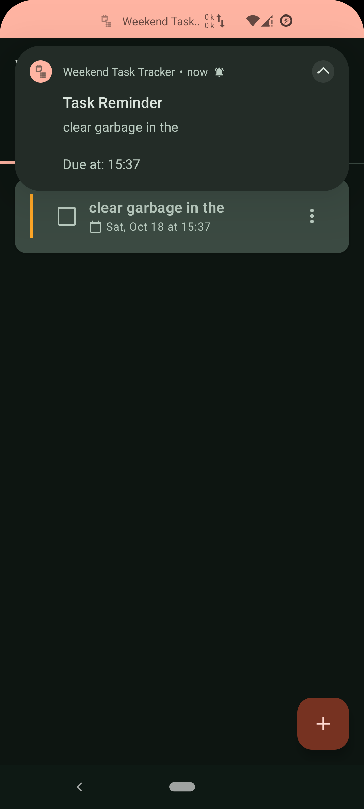

# Weekend Task Tracker

A native Android app for managing weekend tasks using Google ML Kit for natural language processing. Built with Kotlin, Jetpack Compose, and Material Design 3.

## Features

- **Natural Language Task Input**: Create tasks using everyday language like "Clean garage next Saturday at 2pm"
- **Voice Input**: Speak your tasks using Android's built-in speech recognition
- **ML Kit Integration**: Automatic extraction of dates, times, and task descriptions using Google ML Kit
- **Smart Reminders**: Get notified 15 minutes before task due time
- **Monday Auto-Move**: Uncompleted weekend tasks automatically move to master list every Monday
- **Statistics Dashboard**: Comprehensive analytics showing completion rate, weekly trends, and priority distribution
- **Three Task Lists**:
  - **Weekend Tasks**: Active tasks for the current/upcoming weekend
  - **Master List**: Backlog of tasks for future weekends
  - **Completed**: Archive of finished tasks
- **Offline-First**: All data stored locally with Room database
- **Material Design 3**: Modern UI with dynamic color theming
- **Priority Management**: Mark tasks as Low, Medium, or High priority
- **Smart Parsing**: Fallback to Natty date parser when ML Kit needs assistance

## Screenshots

### Main Interface
<table>
  <tr>
    <td></td>
    <td></td>
    <td></td>
  </tr>
  <tr>
    <td align="center"><b>Main Screen</b><br/>Three tabs for organizing tasks</td>
    <td align="center"><b>Add Task with NLP</b><br/>Natural language input</td>
    <td align="center"><b>Task List</b><br/>Priority and due dates</td>
  </tr>
</table>

### Features
<table>
  <tr>
    <td></td>
    <td></td>
    <td></td>
  </tr>
  <tr>
    <td align="center"><b>Voice Input</b><br/>Speak your tasks</td>
    <td align="center"><b>Edit Task</b><br/>Modify task details</td>
    <td align="center"><b>Reminders</b><br/>15-min advance notice</td>
  </tr>
</table>

> **Note**: Place your screenshots in the `/screenshots` directory. See [screenshots/README.md](screenshots/README.md) for guidelines.

## Tech Stack

### Core Technologies
- **Language**: Kotlin
- **UI Framework**: Jetpack Compose
- **Design System**: Material Design 3
- **Architecture**: MVVM (Model-View-ViewModel)
- **Min SDK**: 24 (Android 7.0)
- **Target SDK**: 34 (Android 14)

### Key Libraries
- **Google ML Kit**: Entity Extraction for NLP (v16.0.0-beta5)
- **Room Database**: Local data persistence (v2.6.1)
- **Jetpack Compose**: Modern declarative UI (BOM 2024.02.00)
- **WorkManager**: Background task scheduling (v2.9.0)
- **Natty Date Parser**: Enhanced date/time parsing (v0.13)
- **Kotlin Coroutines**: Asynchronous programming (v1.7.3)
- **Navigation Compose**: Screen navigation (v2.7.7)

## Project Structure

```
com.weekendtasks.app/
├── data/
│   ├── local/
│   │   ├── TaskDatabase.kt          # Room database
│   │   ├── TaskDao.kt               # Data access object
│   │   ├── TaskEntity.kt            # Database entity
│   │   └── Converters.kt            # Type converters
│   ├── repository/
│   │   └── TaskRepository.kt        # Repository pattern
│   └── model/
│       └── Task.kt                  # Domain model
├── domain/
│   ├── usecase/
│   │   ├── AddTaskUseCase.kt        # Business logic for adding tasks
│   │   ├── CompleteTaskUseCase.kt   # Complete task logic
│   │   ├── MoveTaskUseCase.kt       # Move between lists
│   │   ├── DeleteTaskUseCase.kt     # Delete task logic
│   │   ├── UpdateTaskUseCase.kt     # Update task logic
│   │   └── GetTasksUseCase.kt       # Retrieve tasks
│   └── nlp/
│       ├── NaturalLanguageProcessor.kt  # Main NLP coordinator
│       ├── EntityExtractor.kt           # ML Kit integration
│       ├── DateTimeParser.kt            # Natty parser wrapper
│       └── ParsedTask.kt                # NLP result models
├── ui/
│   ├── screens/
│   │   ├── main/
│   │   │   ├── MainScreen.kt        # Main screen with tabs
│   │   │   └── MainViewModel.kt     # Main screen state
│   │   ├── addtask/
│   │   │   ├── AddTaskScreen.kt     # Add/Edit task screen
│   │   │   └── AddTaskViewModel.kt  # Task input state
│   │   ├── weekend/
│   │   │   └── WeekendScreen.kt     # Weekend tasks list
│   │   ├── master/
│   │   │   └── MasterListScreen.kt  # Master list
│   │   └── completed/
│   │       └── CompletedScreen.kt   # Completed tasks
│   ├── components/
│   │   ├── TaskCard.kt              # Reusable task card
│   │   ├── TaskInputField.kt        # Input component
│   │   ├── NLPParsePreview.kt       # Parsing preview
│   │   ├── VoiceInputButton.kt      # Voice input
│   │   ├── DateTimePicker.kt        # Date/time picker
│   │   └── NotificationPermissionDialog.kt  # Permission dialog
│   ├── theme/
│   │   ├── Color.kt                 # Color definitions
│   │   ├── Theme.kt                 # App theme
│   │   └── Type.kt                  # Typography
│   └── navigation/
│       └── NavGraph.kt              # Navigation setup
├── notifications/
│   ├── NotificationHelper.kt        # Notification creation
│   ├── ReminderScheduler.kt         # Schedule task reminders
│   ├── TaskReminderWorker.kt        # Background worker
│   ├── MondayReminderWorker.kt      # Monday auto-move worker
│   └── MondayReminderScheduler.kt   # Monday scheduler
├── di/
│   └── ViewModelFactory.kt          # Dependency injection
├── MainActivity.kt                   # Main activity
└── WeekendTaskApp.kt                # Application class
```

## Setup Instructions

### Prerequisites
- Android Studio Hedgehog (2023.1.1) or newer
- JDK 17 or newer
- Android SDK with API Level 34

### Installation

1. **Clone the repository**:
   ```bash
   git clone <repository-url>
   cd weekend-task-manager
   ```

2. **Open in Android Studio**:
   - Open Android Studio
   - Select "Open an Existing Project"
   - Navigate to the cloned directory
   - Click "OK"

3. **Sync Gradle**:
   - Android Studio should automatically sync Gradle files
   - If not, click "File" > "Sync Project with Gradle Files"

4. **Build the project**:
   ```bash
   ./gradlew build
   ```

5. **Run the app**:
   - Connect an Android device or start an emulator
   - Click the "Run" button in Android Studio
   - Or use: `./gradlew installDebug`

### ML Kit Model Download

**IMPORTANT**: On first launch, the app needs to download the Google ML Kit entity extraction model (~10MB).

- **Internet Required**: The first run requires an internet connection
- **One-Time Download**: The model is cached locally after download
- **Offline After Setup**: All subsequent use is 100% offline
- **Download Time**: Typically 10-30 seconds depending on connection

## Usage

### Creating Tasks with Natural Language

The app understands various natural language patterns:

**Examples**:
```
"Clean garage next Saturday at 2pm"
→ Task: "Clean garage" | Date: Next Saturday | Time: 14:00

"Buy groceries tomorrow morning"
→ Task: "Buy groceries" | Date: Tomorrow | Time: 09:00

"Paint fence this weekend"
→ Task: "Paint fence" | Date: Upcoming Saturday

"Mow lawn every Sunday"
→ Task: "Mow lawn" (recurring feature - planned)

"Fix sink"
→ Task: "Fix sink" | No date/time
```

### Supported Date/Time Patterns

**Dates**:
- "tomorrow", "today"
- "next Saturday", "this Sunday"
- "this weekend", "next weekend"
- Specific dates (via Natty): "March 15", "12/25/2024"

**Times**:
- "2pm", "14:00", "2:30pm"
- "morning" (9:00 AM)
- "afternoon" (2:00 PM)
- "evening" (6:00 PM)
- "night" (8:00 PM)

### Task Operations

1. **Add Task**: Tap the floating "+" button
2. **Complete Task**: Check the checkbox on a task card
3. **Edit Task**: Long-press a task and select "Edit"
4. **Delete Task**: Long-press a task and select "Delete"
5. **Move Task**: Long-press and select "Move to Weekend" or "Move to Master List"
6. **Set Priority**: When creating/editing, choose Low/Medium/High

## Architecture

### MVVM Pattern
- **Model**: Data layer (Room entities, Repository)
- **View**: UI layer (Compose screens)
- **ViewModel**: Business logic and state management

### Data Flow
1. User input → ViewModel
2. ViewModel → Use Case → Repository
3. Repository → Room Database
4. Database → Flow → ViewModel → UI

### State Management
- **StateFlow**: Reactive state for UI
- **Kotlin Flows**: Reactive data streams from Room
- **Coroutines**: Asynchronous operations

## NLP Implementation Details

### ML Kit Entity Extraction
Located in: `domain/nlp/EntityExtractor.kt`

The app uses ML Kit's Entity Extraction API to identify:
- Date entities (tomorrow, next Saturday, etc.)
- Time entities (2pm, afternoon, etc.)
- Date+Time combinations

### Fallback Parser
Located in: `domain/nlp/DateTimeParser.kt`

If ML Kit doesn't recognize a pattern, the app falls back to:
- **Natty Date Parser**: Advanced natural language date parsing
- **Manual Patterns**: Regex-based extraction for common phrases

### Parsing Pipeline
```
User Input
    ↓
ML Kit Entity Extraction
    ↓
(if no entities found)
    ↓
Natty Date Parser
    ↓
(if still no date)
    ↓
Keyword Detection (weekend, morning, etc.)
    ↓
Return ParsedTask
```

## Testing

### Run Unit Tests
```bash
./gradlew test
```

### Test Coverage
- NLP parsing logic
- Task model operations
- Date/time extraction

### Test Files
- `app/src/test/java/com/weekendtasks/app/NLPParsingTest.kt`
- `app/src/test/java/com/weekendtasks/app/TaskRepositoryTest.kt`

## Future Enhancements

Planned features for future releases:

1. **Recurring Tasks**: "every Saturday", "weekly"
2. **Advanced Charts**: Interactive charts with Vico library for detailed trends
3. **Smart Suggestions**: ML Kit Smart Reply for common tasks
4. **Multi-language**: Support for additional languages
5. **Widget Support**: Home screen widget for quick task access
6. **Task Categories**: Organize tasks by category (home, errands, projects, etc.)
7. **Export Statistics**: Generate PDF/CSV reports of task statistics

## Troubleshooting

### ML Kit Model Download Fails
- Ensure internet connection is active
- Check Google Play Services is updated
- Clear app data and try again

### Tasks Not Appearing
- Check database in Device File Explorer: `/data/data/com.weekendtasks.app/databases/`
- Verify Room migrations are up to date

### NLP Not Working
- Ensure ML Kit model is downloaded (check logs)
- Try simple patterns first ("tomorrow", "Saturday")
- Check Natty parser dependency is included

## Performance

- **App Size**: ~8MB (excluding ML Kit model)
- **ML Kit Model**: ~10MB (downloaded on first run)
- **Database**: Lightweight, scales to thousands of tasks
- **Memory**: Efficient with Jetpack Compose and Flow-based architecture

## License

(Add your license here)

## Contributing

(Add contribution guidelines here)

## Contact

(Add contact information here)

---

**Built with:**
- Kotlin
- Jetpack Compose
- Google ML Kit
- Material Design 3
- Room Database
- MVVM Architecture
